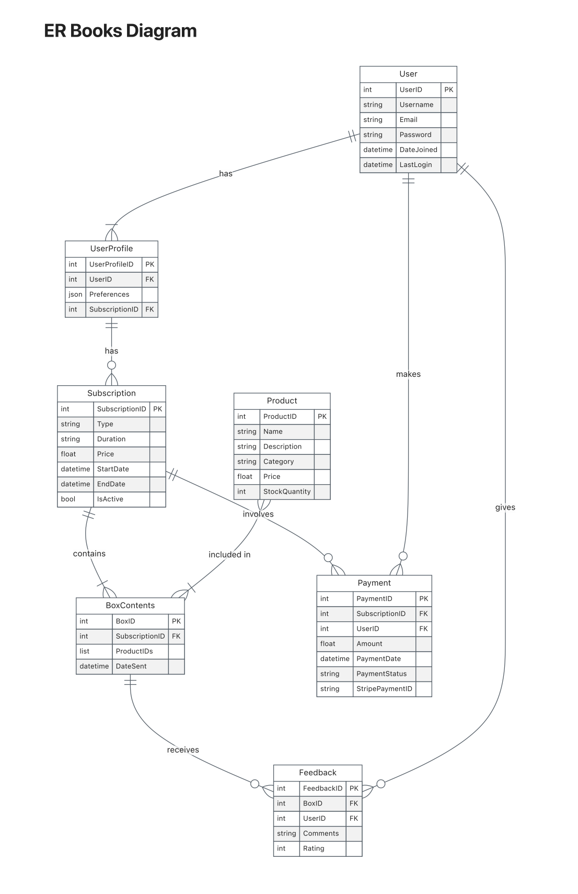
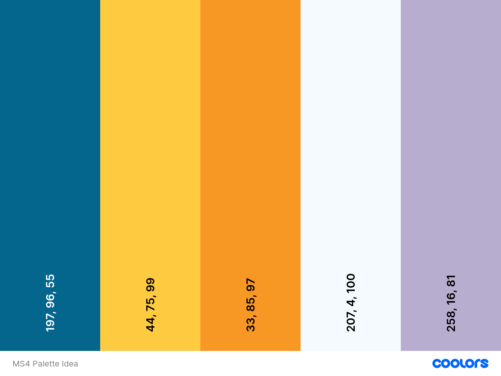

# Bookshelf Box (Books Subscription Service )


> [Live Page](https://ci-ms4-bookshelf-box-b9e87b1c4324.herokuapp.com/)

Welcome to Bookshelf Box, your personalized book subscription service! Whether you're an avid reader or looking to discover new genres, Bookshelf Box offers a convenient way to receive curated selections of books delivered directly to your door.

---

### User Stories

1. #### Account Management

 • As a new user, I want to register for an account so that I can access the product log app.
 • As a registered user, I want to log in to the application so that I can manage my product list.
 • As a registered user, I want to reset my password in case I forget it.

2. #### Product Management

 • As a user, I want to add a new product to my list, including its image, so that I can keep track of my products.
 • As a user, I want to view all my products in a list or grid view so that I can easily navigate through them.
 • As a user, I want to update the details of a product, including changing its image, to keep my product information current.
 • As a user, I want to delete a product from my list when I no longer need it.

3. #### Search and Filter

 • As a user, I want to search for a product by its name to quickly find specific products.
 • As a user, I want to filter products by categories to view products of a specific type.
 • As a user, I want to sort products by the date they were added to see recent additions first.
4. Navigation and Layout:
 • As a user, I want a responsive layout so that I can access the application effectively on both desktop and mobile devices.
 • As a user, I want a fixed bottom footer with relevant links and information.
 • As a user, I want a navigation menu to quickly move between different sections of the application.

5. #### Accessibility

 • As a user with visual impairments, I want the application to be screen-reader friendly so that I can navigate and use the app effectively.
 • As a user with motor impairments, I want to navigate the application using keyboard shortcuts.

6. #### Media Management

 • As a user, I want my uploaded product images to be stored securely and load fast.
 • As a user, I want the application to only accept valid image files to ensure consistency and safety.

7. #### Error Handling and Feedback

 • As a user, I want to receive clear error messages when something goes wrong so that I understand what happened and how to proceed.
 • As a user, I want to receive feedback when my actions (like adding a product) are successful.

---

### Database

### Schema Design

The project was initially created to have the following apps and relatiosnhsips.

<details>
<summary>Entity Relationship Diagram</summary>



</details>

---
---

## Design

### Typography

Roboto | Montserrat | san-serif

---

### Colour Scheme

#### Palette


The original palette scheme that was intended to be used on this project but as design went on deviated to us the following colors.

- primary-color: #2678b8

- secondary-color: #b66426

---

### Wireframes

Wireframes were designed at the start of this project to map out the site but the site has slightly changed since it its original conception to simplify the layout and add different elements and remove unnecessary elements for current features such as a music player.

In addition to not having originally planned to have a custom 404 page but adding it in during the project.

#### Mobile view

<details>
<summary>Mobile View Wireframes</summary>


</details>

---

## Features

### Logo and Navigation Bar

- The navbar featured on all pages is fully responsive and changes to a toggler (hamburger menu) on smaller screens and includes
links to all pages.

### Footer

- Featured on all pages and social media link and copyright.

### User login

- Gives a description of the hone workout company and the trainer that provides the exercises.

### Books

- A table for all the products that the user has logged in to the application.

### Search Books

- A way for user to search the books list and find a desired books from different categories.

### Subscription

- Provides the user with information about the company including phone number, email and social media links.

### Box Content

- This provides a way for the user to see the subscription options that they have put into their box for them to review before they go forward to the checkout to complete payment.

### Checkout

- This provides a page to allow the user to enter in ther delivery details and full name and email address in order to create the subscription and then they will enter in their payment detaisl to complete the purchase.

### Future Features

- Subscription Box Reviews
- Password reset
- Image upload not from link

---
---

## Technologies Used

- Python
- Django
- CSS
- HTML
- SQL

- Bootstrap v5.3:
    Bootstrap has been used for overall responsiveness of the website, and for the layout to include navigation, cards, and footer within the relevant sections of the website.

- Visual Studio Code:
    I used Visual Studio Code as the IDE application with Git for version control of this project.

- GitHub:
    GitHub has been used to create a repository to host the project and receive updated commits from Visual Studio Code.

- Figma:
    I used Figma to create the wireframes for the site to help me with the basic structure the layout and have a guide to design the project with.

- Coolors:
    This online colour palette selector tool was used to see what colour would work well on the site.

- ChatGPT:
    Used to design the logo

- Freepik
    Freepik was used throughout the site as they are copyright and royalty-free stock images and videos.

- Google Fonts:
    The fonts where selected from and imported to style the text on the site.

- Font Awesome:
    Font Awesome was used to apply icons in the Exercises page and Footer section.

---
---

## Testing

[MS4 Testing](/testing.md)

---
---

## Deployment

- The project was deployed to [Heroku](https://www.heroku.com/) using a free relational database from [ElephantSQL](https://www.elephantsql.com/). The deployment process is explained in two parts: setting up the database and deploying to Heroku.

### ElephantSQL

1. Go to [ElephantSQL.com](https://www.elephantsql.com/) and click “Get a managed database today”.
2. Select “Try now for FREE” in the TINY TURTLE database plan.
3. Log in with GitHub and authorize ElephantSQL with your GitHub account.
4. In the Create new team form:
    - Add a team name (your own name is fine).
    - Agree to the Terms of Service and select Yes for GDPR.
    - Provide your email address and click “Create Team”.
5. Click “Create New Instance”.
6. Set up your plan:
    - Name your plan (commonly the project name).
    - Select the Tiny Turtle (Free) plan.
7. Select the closest data centre to you (e.g., EU-West-1 for Ireland).
8. Click "Review", check your details, and then click “Create instance”.
9. Return to the ElephantSQL dashboard and copy the database URL.

### Heroku

1. Install dependencies for Postgres:

    ```shell
    pip3 install dj_database_url
    pip3 install psycopg2
    ```

2. Create a `requirements.txt` file:

    ```shell
    pip3 freeze --local > requirements.txt
    ```

3. Create a `Procfile` to tell Heroku how to run the app:

    ```shell
    web: gunicorn [your app name].wsgi:application
    release: python manage.py migrate && python manage.py load_subscription_options subscriptions/fixtures/subscription_options.json
    ```

4. Ensure the `Procfile` does not have a blank line at the end. Save, commit, and push these files to GitHub.
5. Log in to [Heroku.com](https://www.heroku.com/), click "New", then "Create new app".
6. Name your app, select a region, and click "Create app".
7. Connect the Heroku app to your GitHub repository. Find the correct repository and click "Connect".
8. Add config variables in the Heroku settings tab:

    |KEY|VALUE|
    |---|---|
    |DATABASE_URL|`your variable here`*|
    |EMAIL_HOST_PASS|`your variable here`|
    |EMAIL_HOST_USER|`your variable here`|
    |SECRET_KEY|`your variable here`|
    |STRIPE_PUBLIC_KEY|`your variable here`|
    |STRIPE_SECRET_KEY|`your variable here`|
    |STRIPE_WH_SECRET|`your variable here`|
    |DEVELOPMENT|True**|

    *Paste the URL from the ElephantSQL step.
    **Delete this variable when ready for production.

9. Add your Heroku app hostname to `settings.py`:

    ```python
    ALLOWED_HOSTS = ['bookshelf-box-***.herokuapp.com', 'localhost']
    ```

10. Migrate the database on Heroku. In Heroku, select "More" > "Run console". Type `bash` and run the following commands:

    ```shell
    python3 manage.py makemigrations --dry-run
    python3 manage.py makemigrations
    python3 manage.py migrate --plan
    python3 manage.py migrate
    ```

11. Create a superuser:

    ```shell
    python3 manage.py createsuperuser    
    ```

12. Load the categories data:

    ```shell
    python3 manage.py load_categories
    ```

13. Load the books data:

    ```shell
    python3 manage.py load_books
    ```

14. Your app should now be deployed. Click "Open app" in Heroku to see it live.

---
---

## Credits

### Books Dataset

by Santosh Kumar from [Kaggle](https://www.kaggle.com/datasets/kuchhbhi/treding-book-dataset?resource=download)

**Data Source:** The book data in this dataset was scraped from the [Books to Scrape](https://books.toscrape.com/) website. This source provides a diverse collection of books from various genres, making it an excellent resource for data analysis and research within the literary domain.

**Original Data Columns (Total 12 Columns):**

1. **Title:** The title of the book, representing the book's name.
2. **Category:** The category or genre to which each book belongs.
3. **Image:** URLs or references to images associated with the books.
4. **Rating:** The rating or review score of the book.
5. **Description:** A brief description or summary of the book's content. (Note: There are 998 non-null entries, implying two missing descriptions.)
6. **UPC (Universal Product Code):** A unique product identifier for each book.
7. **Product Type:** The type or format of the book, such as hardcover or paperback.
8. **Price (excl. tax):** The price of the book without taxes.
9. **Price (incl. tax):** The price of the book, including taxes.
10. **Tax:** The tax amount associated with the book.
11. **Availability:** Information about the book's availability for purchase.
12. **Number of Reviews:** The number of reviews or ratings provided by readers for each book.

**Used Data Columns**

1. **Title:** The title of the book, representing the book's name.
2. **Category:** The category or genre to which each book belongs - Categories used in project - Children's, Nonfiction, Fiction, Horror, Fantasy, Young Adult, Classics
3. **Image:**
4. **Rating:**
5. **Description:**
6. **Price (incl. tax):**
7. **Availability:**
8. **Number of Reviews:**

### Images & Videos

[Freepik](https://www.freepik.com/)

[UnSplash](https://www.unsplash.com)

### Code

- Components on the site courtesy of [Bootstrap 5.3](https://getbootstrap.com/docs/4.6/):
  - Navigation Bar Toggle Dropdown Menu

---
---

## Acknowledgements

Thanks to the following people for your help and support in completing this site for the Milestone Project 4 in completion of the Web Application Developmental Diploma delivered by the Code Institute.

- Mentor - Dick Vlad...
- Slack CI Community
-

_This is a fabricated company for the purposes of this project._

 #readme, #ms4, #ci
